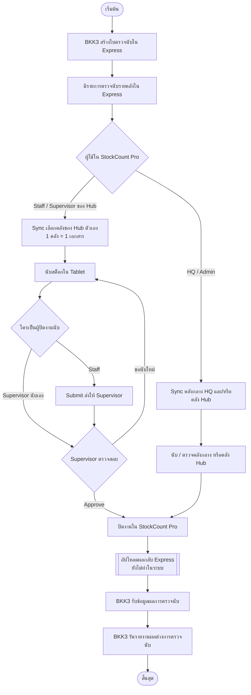
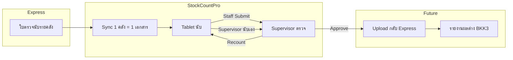

# BKK3 Inventory Count Process Flow

**Date:** 2026-07-13  
**Status:** Current process documentation  
**Scope:** End-to-end flow from Express → StockCount Pro → (future) back to Express

เอกสารนี้อธิบายกระบวนการตรวจนับสต็อกของ **BKK3** ตามระบบ StockCount Pro ที่ใช้งานจริง รวมถึงส่วนที่ยังอยู่นอกแอป

---

## 1. ภาพรวม

1. **BKK3 / Express** สร้างใบตรวจนับและมีรายการสินค้าตามคลัง  
2. **Staff / Supervisor / HQ** ใน StockCount Pro ดาวน์โหลด (Sync) รายคลัง  
3. นับใน Tablet → ส่งตรวจ / อนุมัติ  
4. **(ยังไม่ทำในระบบ)** อัปโหลดผลกลับ Express → BKK3 รันรายงานผลต่าง

### กติกาสำคัญใน StockCount Pro

| หัวข้อ | กติกาปัจจุบัน |
|--------|----------------|
| สาขาหลัก | BKK3 (`expressLocationPrefix = 24`) |
| เอกสาร | **1 คลัง Express = 1 เอกสาร** |
| Hub ที่เปิดใช้ | Hub 1 CHM, Hub 2 PNL |
| สิทธิ์คลัง Hub | ตาม Hub ที่ assign ให้ผู้ใช้ |
| คลังกลาง HQ | `24G1`, `24D1`, `24F1`, `24Z1`, `24R1`, `24S1`, `24C1` — เฉพาะ HQ/Admin |
| Supervisor | นับ + Sync + ตรวจ ได้ (กรณีคนสาขาไม่พอ) |
| ลบเอกสาร | ได้เฉพาะสถานะยังไม่เริ่มนับ (`IMPORTED`) |

---

## 2. Flowchart (กระบวนการปัจจุบัน + ขั้นตอนถัดไป)

สัญลักษณ์ `[[...]]` = ขั้นตอนธุรกิจที่วางไว้แล้ว แต่ยังไม่มีใน StockCount Pro

---

## 3. รายละเอียดทีละช่วง

### 3.1 นอกแอป — Express / BKK3

| ขั้นตอน | ผู้รับผิดชอบ | รายละเอียด |
|---------|--------------|------------|
| สร้างใบตรวจนับ | BKK3 / Express | สร้างเอกสารและรายการนับตามวันที่/คลังใน Express |
| พร้อมให้ดึงข้อมูล | Express API | StockCount Pro ดึงผ่าน API locations + stock lines |

### 3.2 Sync เข้า StockCount Pro

| Role | ทำอะไรได้ |
|------|-----------|
| STAFF / COUNTER / SUPERVISOR / BRANCH_MANAGER | Sync เฉพาะคลังที่อยู่ใน Hub ของตัวเอง |
| HQ / ADMIN | Sync ได้ทั้งคลัง Hub และคลังกลาง HQ |

ผลลัพธ์ Sync:

- เลือกหลายคลัง → ได้หลายเอกสาร  
- ชื่อเอกสารตัวอย่าง: `2411 · ชื่อคลังเต็ม (2026-07-10)`  
- สถานะเริ่มต้น: `IMPORTED`  
- ถ้ายังไม่เริ่มนับ สามารถ **ลบเอกสาร** ได้

### 3.3 นับสต็อก (Tablet)

| Role | ความสามารถ |
|------|------------|
| STAFF / COUNTER | นับในเอกสาร Hub ที่ได้รับสิทธิ์ |
| SUPERVISOR / BRANCH_MANAGER | นับได้เช่นกัน (รองรับกรณีคนไม่พอ) |
| HQ / ADMIN | นับเอกสารที่เข้าถึงได้ รวมคลังกลาง |

หลังนับ:

- **Staff** → Submit ให้ Supervisor  
- **Supervisor ที่นับเอง** → ไปตรวจ/อนุมัติต่อได้

### 3.4 ตรวจและอนุมัติ (Supervisor)

| การกระทำ | ผล |
|----------|-----|
| ขอให้นับใหม่ | สร้างรอบนับใหม่ → กลับไปนับใน Tablet |
| Approve | ปิดงานเอกสารใน StockCount Pro |

### 3.5 กลับ Express / รายงาน (ยังไม่ในระบบ)

| ขั้นตอน | สถานะ |
|---------|--------|
| อัปโหลดผลการนับกลับ Express | **ยังไม่ implement** |
| BKK3 รับผลและรันรายงานผลต่าง | ทำนอก StockCount Pro |

---

## 4. แผนภาพ Role (สรุปสั้น)

---

## 5. ตัวอย่างวันทำงานจริง

1. Express มีคลัง `2411`, `2412`, `24GA` ของ Hub CHM และ `24G1` ของ HQ  
2. `chm.staff` Sync เลือก `2411` + `2412` → ได้ 2 เอกสาร  
3. นับครบ → Submit  
4. `chm.supervisor` ตรวจ → Approve (หรือขอนับใหม่)  
5. `hq` Sync `24G1` แยกต่างหาก  
6. **ถัดไป (ยังไม่มี):** ดันผลกลับ Express แล้วให้ BKK3 รันรายงานผลต่าง

---

## 6. สิ่งที่อยู่นอกขอบเขตเอกสารนี้

- Mapping ฟิลด์สินค้า Express รายคอลัมน์  
- รายละเอียด API Express (ดู `docs/EXPRESS_API_SETUP.md`)  
- ออกแบบฟีเจอร์ Upload กลับ Express (ต้องทำ spec แยกเมื่อพร้อม implement)

---

## 7. เอกสารที่เกี่ยวข้อง

| เอกสาร | เนื้อหา |
|--------|---------|
| `docs/superpowers/specs/2026-07-10-bkk3-hub-model-design.md` | Hub / คลังกลาง HQ |
| `docs/superpowers/specs/2026-07-13-per-location-documents-design.md` | 1 คลัง = 1 เอกสาร |
| `docs/EXPRESS_API_SETUP.md` | การตั้งค่า Express API |
| `docs/INVENTORY_COUNT_PRD.md` | PRD ภาพรวมระบบนับสต็อก |
